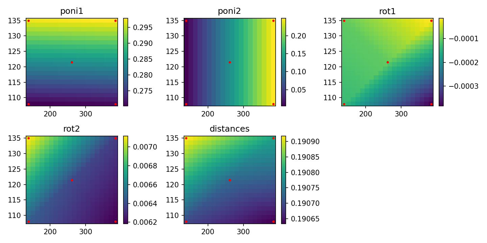
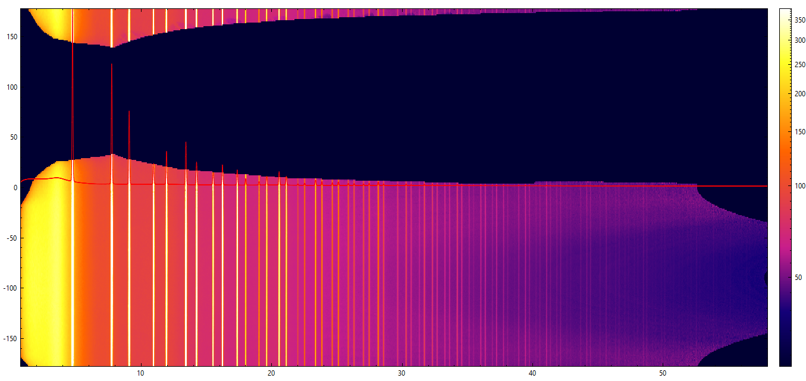
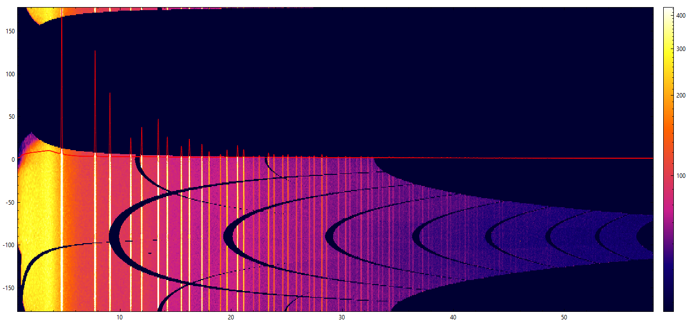

A library for processing total-scattering data with multiple detector positions on BM31.

Usage: Must make ponis for a handful of calibration images (5 or so, must include corner positions). These are loaded together with detector y (and optional z) positions into the PoniData class. The ponis for the rest of the positions are then interpolated in 1 or 2 dimensions with the PoniList class. CBF files are loaded into the FilePoni class together with their detector y (and z) positions, and the PoniList, and a interpolated poni is calculated for it, then it is integrated.

The MultiFile class then takes a list of all the FilePoni objects. It regrids the cake arrays to the same axes and merges them together, saves a merged cake file, and 1D merged patterns.

2D interpolation of ponis


merged Si cake from data measured in 2 dimensions


single Si cake



Usage:
```Python
from multipospdf import FilePoni, MultiFile, PoniData,PoniList
from glob import glob
import os
ponidir = 'PathToData'
datasubdirs = ['s1','s2','s3'] #assuming data in <ponidir>/<subdir>
maskfile = f'{ponidir}/maskfile.edf'
cakemask = f'{ponidir}/cakemask.edf' #a mask file in the shape of the outputted merged cake
ponis = glob(f'{ponidir}*.poni')

def getyz(file): #assuming files are in format: x_dty125.40_dtz135.00_...
    basefile = os.path.splitext(os.path.basename(file))[0]
    filesplit = basefile.split('_')
    ypos = float(filesplit[1].replace('dty',''))
    zpos = float(filesplit[2].replace('dtz',''))
    return ypos,zpos

ponilist = []
for p in ponis:
    ypos,zpos = getyz(p)
    ponilist.append(PoniData(p,ypos,zpos))
ponilist = PoniList(ponilist)

ponilist.plot2d() #plot a grid of interpolated poni values with calculated positions overlayed

def main(datadir):
    tth0 = 0.75
    tthend = 58
    npoints = 5000
    cbfs = glob(f'{datadir}/*.cbf')
    fps = []
    for f in cbfs:
        y,z = getyz(f)
        fps.append(FilePoni(f,y,zpos=z, ponilist=ponilist,maskfile=maskfile)) #can use individual masks if necessary
    filedata = MultiFile(fps)
    filedata.average1d(tth0,tthend, npoints=npoints)
    filedata.average2d(cakemask=cakemask)
    #filedata.saveEDF_noheader(ponidir) #can use this to make a file to load into silx to make a cake mask
    
for d in datasubdirs:
    main(f'{ponidir}/{d}')
```

