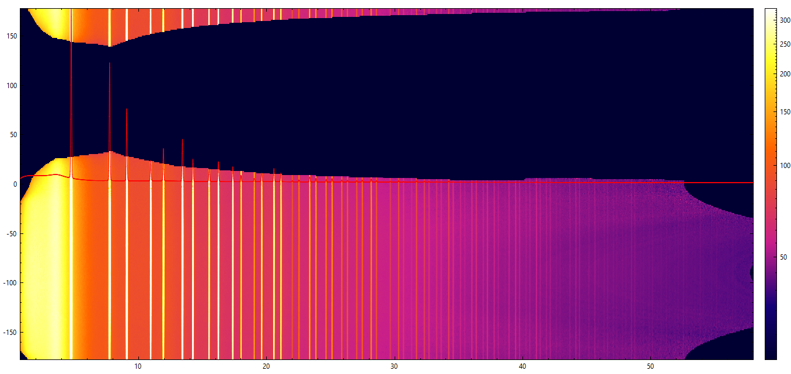

A library for processing total-scattering data with multiple detector positions on BM31.

Usage: Must make ponis for a handful of calibration images (5 or so, must include corner positions). These are loaded together with detector y (and optional z) positions into the PoniYZ class. The ponis for the rest of the positions are then interpolated in 1 or 2 dimensions with the PoniList class. CBF files are loaded into the ImagePoni class together with their detector y (and z) positions, and the PoniList, and a interpolated poni is calculated for it, then it is integrated.

The MultiFile class then takes a list of all the ImagePoni objects. It averages and merges all the cake arrays, filtering cosmics and outliers, saves a merged cake file, and 1D merged patterns.

2D interpolation of ponis


merged Si cake from data measured in 2 dimensions


single Si cake


## Usage:
```Python
from multipospdf import ImagePoni, MultiFile, PoniYZ,PoniList, getIPlist, getponilist
from glob import glob
import os
ponidir = 'PathToData'
datasubdirs = ['s1','s2','s3'] #assuming data in <ponidir>/<subdir>
maskfile = f'{ponidir}/maskfile.edf'
cakemask = f'{ponidir}/cakemask.edf' #a mask file in the shape of the outputted merged cake
ponis = glob(f'{ponidir}/*.poni')


def main(datadir,fname=''):
    tth0 = 0.75
    tthend = 58
    npoints = 5000
    ponilist = getponilist(ponidir) #PoniList type - files must be in format ..._dty124.32_dtz256.62_...
    #ponilist.plot2d() #plot a grid of interpolated poni values with calculated positions overlayed
    filedata = getIPlist(datadir, ponilist) #MultiFile type - files must be in format ..._dty124.32_dtz256.62_...

    filedata.average1d(tth0,tthend, npoints=npoints,polarization_factor = 0.85,fname=fname)
    filedata.average2d(cakemask=cakemask,fname=fname)
    #filedata.saveEDF_noheader(ponidir) #can use this to make a file to load into silx to make a cake mask

for d in datasubdirs:
    main(f'{ponidir}/{d}',fname=d)
```

